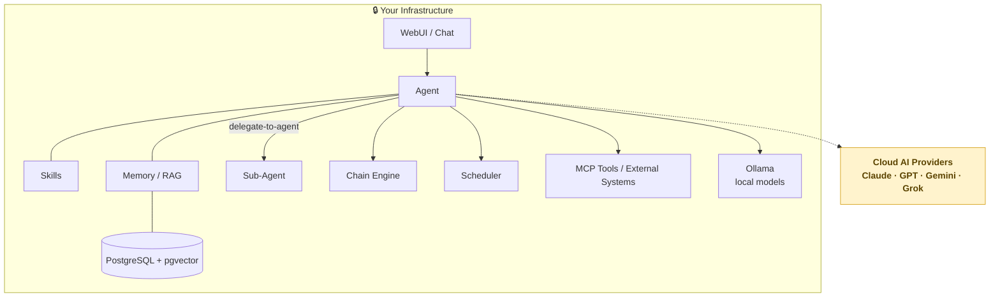

# Ontheia

**Your Data. Your AI. Your Rules.**

Every time AI work runs on someone else's infrastructure, you give up more than privacy. You give up control over data, tools, workflows, and the rules that govern how work gets done.

**Ontheia** is a self-hosted, open-source AI agent platform for work that stays under your control. It keeps AI capable and connected — within boundaries you set.

Most AI setups stay fragmented: separate chats, tools, scripts, and automations with no shared memory, no continuity, and no operational boundaries. Ontheia brings specialized agents, tools, memory, scheduling, and delegation into one governed work context — on your own infrastructure.

→ **[ontheia.ai](https://ontheia.ai)** · [Documentation](https://docs.ontheia.ai) · [Blog](https://ontheia.ai/blog)

[](./LICENSE)
[](./LICENSE-COMMERCIAL.md)


---

## More than the sum of its parts

No single feature is the point. The shift comes from combining them.

An agent in Ontheia can break a request into subtasks and hand them to other specialized agents — each with its own tools, memory, and skills. They coordinate, remember across sessions, and act on their own schedule. A fresh install ships with two agents to start from: the **Ontheia Guide** walks you through setup, and a **Personal Assistant** is ready to work.

This isn't a chat UI with plugins, prompt-based automation, or a bare agent runtime — it's an operational layer for sovereign AI work: agents that use your tools, retain context, coordinate capabilities, and operate over time, all inside one system you control.

---

## What's inside

- **Specialized capabilities** — use agents and Agent Skills instead of one generic assistant. Skills are reusable modules based on the open Agent Skills standard, and the built-in **skill-creator** can build and test new ones directly in chat.
- **Delegation & coordination** — hand work off across specialists with the `delegate-to-agent` tool, either autonomously or as declarative Chain steps.
- **Tools & external systems** — Ontheia is **MCP-native**, so agents can connect to tools and services over an open standard instead of proprietary integrations.
- **Persistent memory you can govern** — built-in RAG with **pgvector**, isolated by user and namespace. Entries are filed by the kind of memory they are: **episodic**, **semantic**, **procedural**, **working**, **document**. That is what makes memory governable rather than merely searchable.
- **Workflows** — the visual **Chain Engine** turns multi-step logic into no-code pipelines.
- **Diagrams in chat** — the agent writes Mermaid, the chat renders it live: flowcharts, sequence, class, ER, Gantt, state, mind maps, and more (12+ types). No render server, no export detour — a built-in skill keeps the syntax and layout clean.
- **Files as artifacts, not walls of text** — when an agent reads or writes a file, a card appears; one click opens it in a side panel with edit/preview, conflict-safe saving, and a built-in PDF viewer. Every code block in an answer carries a pencil: revise it in the panel and save it as a file. The agent stops repeating file contents in its answers and quotes only what it discusses — which also saves a substantial number of tokens.
- **Scheduling** — run recurring or one-time jobs automatically, including jobs that resume an existing chat where it left off.
- **Vendor-agnostic** — Claude, ChatGPT, Gemini, Grok, Ollama, or any OpenAI-compatible model. Switch providers without rewriting agents.
- **Reasoning models, made visible** — Ontheia speaks both reasoning paths: OpenAI's Responses API, so reasoning and function tools work together where chat completions no longer allows it, and Anthropic's extended thinking. Effort is configurable per model, thinking survives across tool iterations, and a dedicated **Reasoning tab** in the trace panel shows what the model actually thought — not just what it answered.
- **Safe file handling** — a built-in `files` skill lets agents search, read, write, edit and move files with guarantees that make mistakes impossible, not just discouraged: writes never clobber (recoverable trash), edits need an exact match, and concurrent changes are caught by content hash. No config needed.
- **Governance & control** — self-hosted and **GDPR-compliant by architecture** — data never leaves your servers. Role-based access enforced with PostgreSQL Row Level Security; you decide *per agent* which model can access which data. In multi-user setups, per-user file access is enforced server-side — one user's agents can't reach another's files.

---

## How it works



Everything that matters — chat history, memory, skills, workflows, schedules, tool connections — stays inside your infrastructure. Only the model inference call crosses the boundary, and you choose which provider gets it.

---

## Screenshots

|  |  |
|---|---|
|  |  |
| *What can I use Ontheia for?* | *Exa search → PDF summary → email — in one step.* |
|  |  |
| *Describe a process — Ontheia renders it as a flowchart.* | *Turn a project brief into a structured mind map.* |

---

## Requirements

| Requirement | Minimum | Notes |
|---|---|---|
| **OS** | Linux / macOS | Windows via WSL2 |
| **Docker** | 24+ | Rootless mode recommended |
| **Docker Compose** | v2 (plugin) | `docker compose` (not `docker-compose`) |
| **RAM** | 2 GB | 4 GB recommended |
| **Disk** | 5 GB free | 10 GB recommended |
| **Ports** | 8080, 5173 | Configurable during setup |
| **openssl** | any | For secret generation (`apt install openssl`) |
| **curl** | any | For health checks |
| **jq** | any | For JSON parsing (`apt install jq`) |

At least one AI provider API key is required to chat (e.g. Anthropic, OpenAI, or a local Ollama instance). Memory/RAG features additionally require an embedding-capable provider.

---

## Quick Start

**Guided setup** (recommended) — one command, configures everything interactively:

```bash
curl -fsSL https://get.ontheia.ai | bash
```

This downloads Ontheia to `~/ontheia` and runs the installer, which handles `.env` creation, secret generation, Docker builds, database migrations, and bootstraps the first admin account.

Prefer to inspect the script first? Clone and run it from the repository:

```bash
git clone https://github.com/Ontheia/ontheia.git
cd ontheia
bash scripts/install.sh
```

**Manual setup:**

```bash
git clone https://github.com/Ontheia/ontheia.git
cd ontheia
cp .env.example .env
# Edit .env — set FLYWAY_PASSWORD, ONTHEIA_APP_PASSWORD, ADMIN_EMAIL
docker compose up -d
```

**Open Ontheia**

Visit [http://localhost:5173](http://localhost:5173) in your browser.

Full installation guide: [docs.ontheia.ai/en/getting-started/02_installation](https://docs.ontheia.ai/en/getting-started/02_installation)

---

## Documentation

Full documentation at **[docs.ontheia.ai](https://docs.ontheia.ai)**

| Topic | EN | DE |
|---|---|---|
| Introduction | [EN](https://docs.ontheia.ai/en/getting-started/01_introduction) | [DE](https://docs.ontheia.ai/de/getting-started/01_introduction) |
| Installation | [EN](https://docs.ontheia.ai/en/getting-started/02_installation) | [DE](https://docs.ontheia.ai/de/getting-started/02_installation) |
| Environment variables | [EN](https://docs.ontheia.ai/en/configuration/01_environment_variables) | [DE](https://docs.ontheia.ai/de/configuration/01_environment_variables) |
| Agents | [EN](https://docs.ontheia.ai/en/admin/agents/01_concept) | [DE](https://docs.ontheia.ai/de/admin/agents/01_concept) |
| Agent Skills | [EN](https://docs.ontheia.ai/en/admin/skills/01_concept) | [DE](https://docs.ontheia.ai/de/admin/skills/01_concept) |
| Chain Engine | [EN](https://docs.ontheia.ai/en/admin/chains/01_concept) | [DE](https://docs.ontheia.ai/de/admin/chains/01_concept) |
| Memory / RAG | [EN](https://docs.ontheia.ai/en/admin/memory_audit/01_architecture) | [DE](https://docs.ontheia.ai/de/admin/memory_audit/01_architecture) |
| Security | [EN](https://docs.ontheia.ai/en/security/01_security_concept) | [DE](https://docs.ontheia.ai/de/security/01_security_concept) |
| Automation | [EN](https://docs.ontheia.ai/en/automation/01_overview) | [DE](https://docs.ontheia.ai/de/automation/01_overview) |
| API Reference | [EN](https://docs.ontheia.ai/en/api/01_api-ref) | [DE](https://docs.ontheia.ai/de/api/01_api-ref) |

---

## Stack

- **Backend:** Node.js / TypeScript (Fastify)
- **Frontend:** React, shadcn/ui, Tailwind CSS
- **Database:** PostgreSQL with pgvector extension
- **Containerization:** Docker, Docker Compose (rootless)
- **AI Protocols:** Anthropic Messages API, OpenAI-compatible API, MCP (Model Context Protocol)

---

## Roadmap

See [ROADMAP.md](./ROADMAP.md) for planned features across all horizons.

Community input is welcome — open an [issue](https://github.com/Ontheia/ontheia/issues) or start a [discussion](https://github.com/Ontheia/ontheia/discussions).

---

## Contributing

Contributions are welcome.

1. Fork the repository
2. Create a feature branch
3. Submit a pull request

Please read [CONTRIBUTING.md](./CONTRIBUTING.md) before opening a pull request.

If Ontheia resonates with you, a ⭐ helps others find it — and helps us build a community around sovereign AI.

---

## License

Ontheia is dual-licensed:

1. **Open Source:** [GNU Affero General Public License v3.0](./LICENSE) — free for personal use, self-hosted deployments, and open-source projects.
2. **Commercial:** [Commercial License](./LICENSE-COMMERCIAL.md) — for organizations that need to use Ontheia without AGPL obligations (e.g. as part of a proprietary product or managed service). Contact us via [ontheia.ai](https://ontheia.ai) for inquiries.

---

## Contact

- Website: [ontheia.ai](https://ontheia.ai)
- GitHub Discussions: [github.com/Ontheia/ontheia/discussions](https://github.com/Ontheia/ontheia/discussions)

---

© 2026 Ontheia · Open source under AGPL-3.0.
