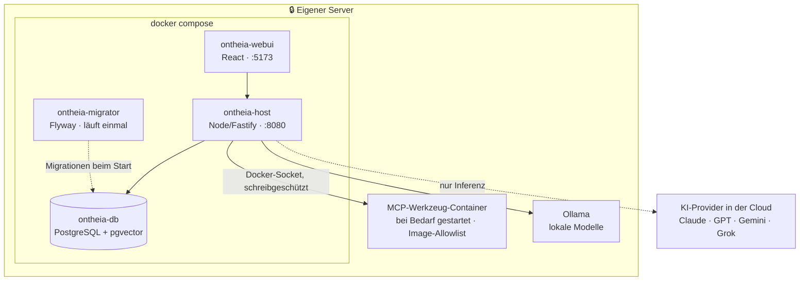

Ontheia wird als Docker-Stack betrieben.

## Voraussetzungen

| Anforderung | Minimum | Hinweis |
|---|---|---|
| **Betriebssystem** | Linux / macOS | Windows via WSL2 |
| **Docker** | 24+ | Rootless-Modus empfohlen |
| **Docker Compose** | v2 (Plugin) | `docker compose` (nicht `docker-compose`) |
| **RAM** | 2 GB | 4 GB empfohlen |
| **Speicherplatz** | 5 GB frei | 10 GB empfohlen |
| **Ports** | 8080, 5173 | Konfigurierbar |
| **openssl** | beliebig | Für Secret-Generierung (`apt install openssl`) |
| **curl** | beliebig | Für Health Checks |
| **jq** | beliebig | Für JSON-Verarbeitung (`apt install jq`) |
| **Terminal** | interaktiv | Der Installer fragt Sprache, Lizenz und Admin-Zugang ab |

Mindestens ein API-Key eines KI-Anbieters ist erforderlich (z. B. Anthropic, OpenAI oder eine lokale Ollama-Instanz).

> **Interaktives Terminal nötig.** Der Installer liest seine Eingaben aus `/dev/tty` — deshalb funktioniert er auch hinter `curl … | bash`, wo die Standardeingabe bereits belegt ist. Ohne echtes Terminal (etwa in einer CI-Pipeline oder bei `ssh` ohne `-t`) bricht er sofort mit einem Hinweis ab, statt eine halb eingerichtete Installation zu hinterlassen. Über SSH also `ssh -t` verwenden.

## Schnellstart (empfohlen)

Das Installationsskript übernimmt `.env`-Erstellung, Secret-Generierung, Docker-Builds, Datenbank-Migrationen und die Einrichtung des ersten Admin-Accounts. Ein Befehl — lädt Ontheia nach `~/ontheia` und startet den interaktiven Installer:

```bash
curl -fsSL https://get.ontheia.ai | bash
```

Wer das Skript vorher prüfen möchte, klont das Repository und führt es von dort aus:

```bash
git clone https://github.com/Ontheia/ontheia.git
cd ontheia
bash scripts/install.sh
```

## Manuelle Installation

```bash
git clone https://github.com/Ontheia/ontheia.git
cd ontheia
cp .env.example .env
# .env bearbeiten — FLYWAY_PASSWORD, ONTHEIA_APP_PASSWORD, ADMIN_EMAIL setzen
docker compose up -d
```

## Ontheia aufrufen

Öffnen Sie [http://localhost:5173](http://localhost:5173) in Ihrem Browser.

## Was auf dem Server läuft

Nach `docker compose up -d` steht folgendes Bild:



Drei Punkte, die beim ersten Blick auf `docker compose ps` irritieren können:

- **Der Migrator beendet sich.** Er bringt beim Start das Datenbankschema auf den aktuellen Stand und wird dann fertig — vier Dienste in der Compose-Datei, drei laufende Container. Das ist der Normalzustand, kein Fehler.
- **MCP-Werkzeuge laufen in eigenen Containern**, die der Host bei Bedarf startet. Der Docker-Socket ist dafür **schreibgeschützt** eingehängt, und jedes Image wird gegen `config/allowlist.images` geprüft. Werkzeuge, die als `stdio`-Prozess laufen (`uvx`, `npx`), starten stattdessen im Host-Container selbst.
- **Nur ein Pfeil verlässt den Kasten.** Chats, Gedächtnis, Skills, Zeitpläne und Werkzeug-Verbindungen bleiben auf dem eigenen Server; nach außen geht ausschließlich der Aufruf des Sprachmodells — und auch nur zu dem Provider, den man selbst einträgt. Mit Ollama entfällt auch dieser.
