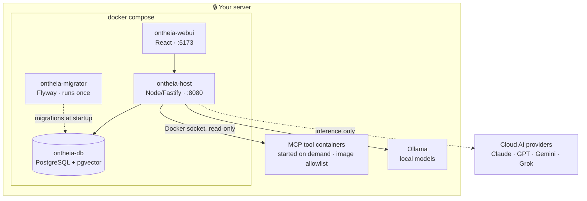

Ontheia runs as a Docker stack.

## Requirements

| Requirement | Minimum | Notes |
|---|---|---|
| **OS** | Linux / macOS | Windows via WSL2 |
| **Docker** | 24+ | Rootless mode recommended |
| **Docker Compose** | v2 (plugin) | `docker compose` (not `docker-compose`) |
| **RAM** | 2 GB | 4 GB recommended |
| **Disk** | 5 GB free | 10 GB recommended |
| **Ports** | 8080, 5173 | Configurable |
| **openssl** | any | For secret generation (`apt install openssl`) |
| **curl** | any | For health checks |
| **jq** | any | For JSON parsing (`apt install jq`) |
| **Terminal** | interactive | The installer asks for language, license and admin account |

At least one AI provider API key is required (e.g. Anthropic, OpenAI, or a local Ollama instance).

> **An interactive terminal is required.** The installer reads its input from `/dev/tty`, which is why it also works behind `curl … | bash`, where standard input is already taken. Without a real terminal — in a CI pipeline, or over `ssh` without `-t` — it stops immediately with a notice instead of leaving a half-configured installation behind. Over SSH, use `ssh -t`.

## Quick Start (recommended)

The install script handles `.env` creation, secret generation, Docker builds, database migrations, and bootstraps the first admin account. One command — it downloads Ontheia to `~/ontheia` and starts the interactive installer:

```bash
curl -fsSL https://get.ontheia.ai | bash
```

Prefer to inspect the script first? Clone and run it from the repository:

```bash
git clone https://github.com/Ontheia/ontheia.git
cd ontheia
bash scripts/install.sh
```

## Manual Setup

```bash
git clone https://github.com/Ontheia/ontheia.git
cd ontheia
cp .env.example .env
# Edit .env — set FLYWAY_PASSWORD, ONTHEIA_APP_PASSWORD, ADMIN_EMAIL
docker compose up -d
```

## Open Ontheia

Visit [http://localhost:5173](http://localhost:5173) in your browser.

## What Runs on Your Server

After `docker compose up -d`, this is the picture:



Three things that can look wrong at a first `docker compose ps`:

- **The migrator exits.** It brings the database schema up to date at startup and is then finished — four services in the compose file, three running containers. That is the normal state, not a failure.
- **MCP tools run in containers of their own**, started by the host when needed. The Docker socket is mounted **read-only** for this, and every image is checked against `config/allowlist.images`. Tools that run as a `stdio` process (`uvx`, `npx`) start inside the host container instead.
- **Only one arrow leaves the box.** Chats, memory, skills, schedules and tool connections stay on your server; the only outbound call is the one to the language model — and only to the provider you entered yourself. With Ollama, even that one disappears.
