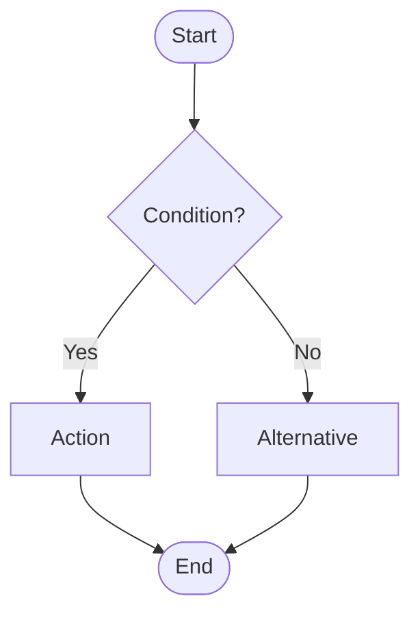
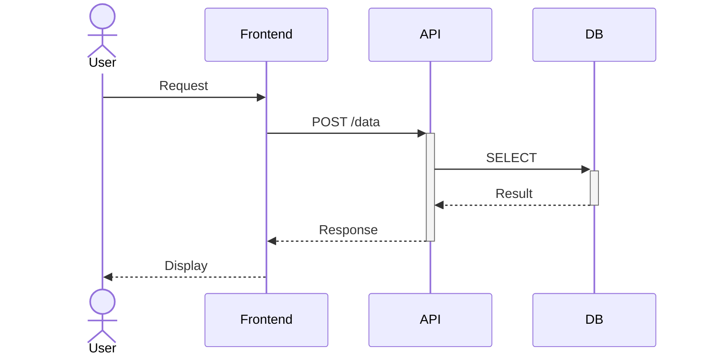
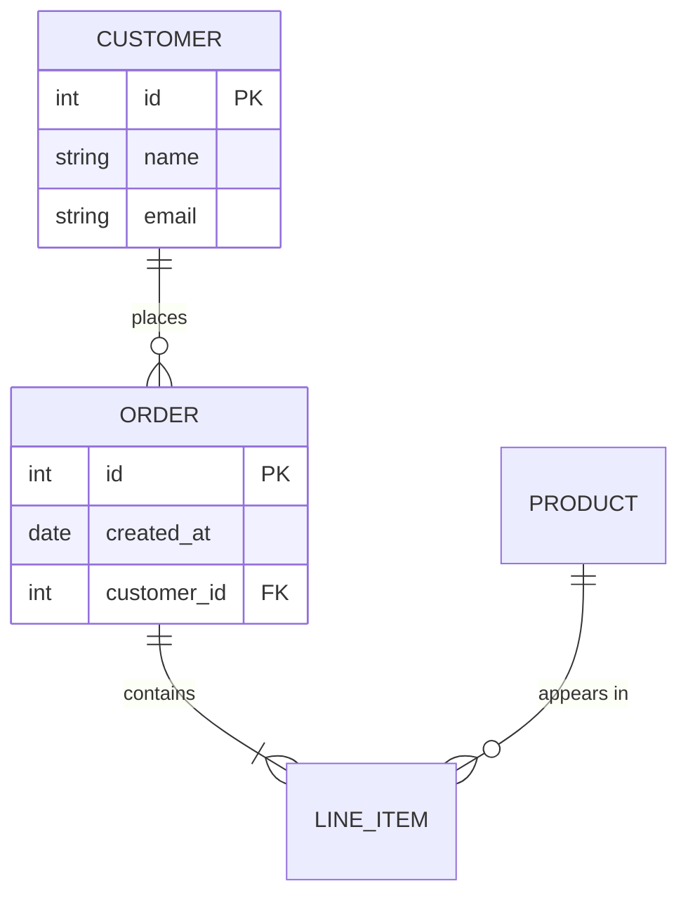
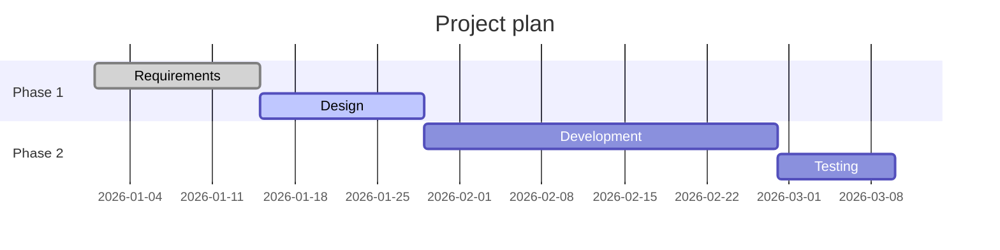
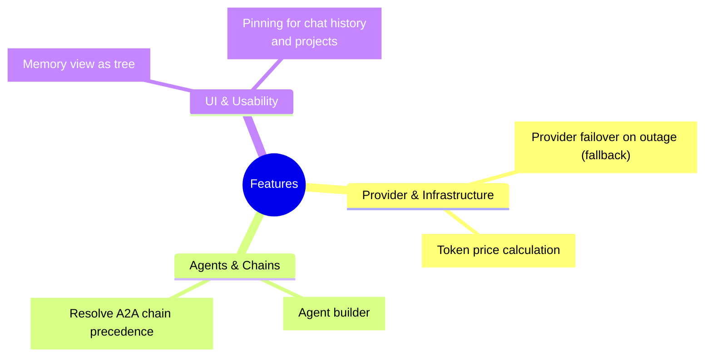
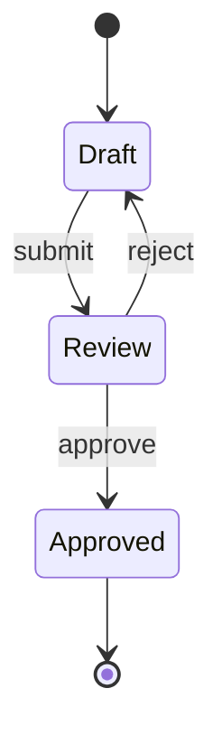

# Mermaid Diagram Skill

## Output

Always emit Mermaid code in a fenced code block — the chat renders it as a diagram:

~~~
```mermaid
<diagram code>
```
~~~

No rendering tool, no script needed — just emit correct code. One diagram per
fenced block. If the code does not parse, the chat shows it as a plain code
block instead of a diagram — syntax errors are never partially rendered, so
follow the syntax rules below strictly.

---

## Choosing the diagram type

| Goal | Type | Keyword |
|------|------|---------|
| Process / flow / decision | Flowchart | `flowchart TD` |
| Communication between systems / sequence | Sequence diagram | `sequenceDiagram` |
| Classes / objects / inheritance | Class diagram | `classDiagram` |
| Database structure / relations | ER diagram | `erDiagram` |
| Project schedule / phases | Gantt | `gantt` |
| States / status transitions | State diagram | `stateDiagram-v2` |
| Ideas / concepts / structure | Mindmap | `mindmap` |
| Shares / distribution | Pie chart | `pie` |
| Git branches / commits | Git graph | `gitGraph` |
| Tasks / columns | Kanban | `kanban` |
| Timeline / milestones | Timeline | `timeline` |
| X/Y data / bars / lines | XY chart | `xychart-beta` |
| System / service architecture | Flowchart with subgraphs (preferred) or `architecture-beta` | `flowchart TB` |

---

## Quick reference: common types

### Flowchart



Directions: `TD` (top→down) · `LR` (left→right) · `BT` · `RL`

Node shapes: `[rectangle]` · `(rounded)` · `{diamond}` · `([stadium])` · `[[subroutine]]` · `[(cylinder)]` · `((circle))`

Connections: `-->` · `---` · `-.->` · `==>` · `--label-->` · `--o` · `--x`

Subgraph:
```
subgraph Title
    A --> B
end
```

### Sequence diagram



Arrows: `->>` (solid) · `-->>` (dashed) · `->>+` / `->>-` (activation box) · `-)` (async)

More elements: `Note over A,B: text` · `loop condition` / `end` · `alt/else/end` · `par/and/end`

### ER diagram



Cardinalities: `||--||` (1:1) · `||--o{` (1:0..n) · `||--|{` (1:1..n) · `}o--o{` (n:m)

### Gantt



### Mindmap

**Mandatory rules — check before emitting any mindmap:**
1. **Always quote free-text labels (titles, sentences, copied text) as `["..."]`** — parentheses/special characters in a plain label cause parse errors or swallowed text. Only self-chosen short branch names (1–3 words, no special characters) may stay plain — without backslash escapes (`Provider & Infrastructure` ✓, `Provider\ &\ Infrastructure` ✗ displays the backslashes; spaces and `&` need no escaping).
2. **Group into 3–6 thematic branches from ~8 entries** — flat lists make the nodes overlap.
3. Wrap labels longer than ~50 characters with `<br/>`.



### State diagram



---

## Syntax rules & common mistakes

- **Node identifiers** without spaces or special characters: `myNode` ✓, `my node` ✗
- **Text with special characters** in quotes: `A["text with: colon"]`
- **`end`** is reserved — never use it as a node name
- **Line breaks** in labels: `<br/>` or `<br>` inside the text
- Flowchart: avoid `o` and `x` at the start of a node name (`--o` / `--x` are arrow types)
- **Mindmap:** follow the mandatory rules in the mindmap section above — always quote free-text labels as `["..."]` (parentheses are shape syntax → parse error or swallowed text), group from ~8 entries
- Long diagrams: use subgraphs / groups for readability
- Theme via directive: `%%{init: {"theme": "neutral"}}%%` before the diagram type
- **`click` interactions (links, callbacks) do not work in the chat renderer** (strict security level) — do not use them

---

## Detailed syntax

For the full syntax reference of individual types, use `read_skill_resource` on
- `references/FLOWCHART.md`
- `references/SEQUENCE.md`
- `references/DIAGRAMS.md` (class, ER, Gantt, state, mindmap, pie, git, XY, kanban, timeline, quadrant, block, architecture)
