# Other diagram types — syntax reference

## Class diagram (`classDiagram`)

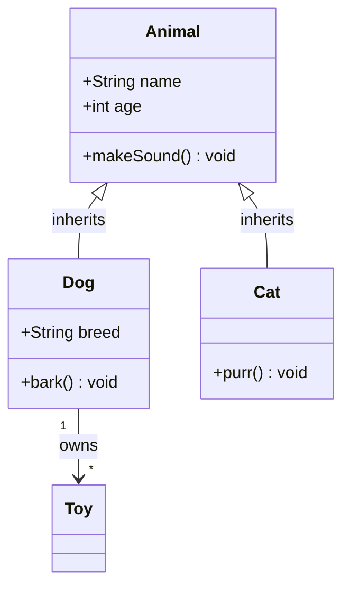

### Visibility
`+` public · `-` private · `#` protected · `~` package

### Relationships
| Symbol | Meaning |
|--------|---------|
| `<\|--` | Inheritance (inherits from) |
| `*--` | Composition |
| `o--` | Aggregation |
| `-->` | Association |
| `--` | Link (solid) |
| `..\|>` | Realization |
| `..>` | Dependency |
| `..` | Link (dashed) |

Multiplicity: `"1"`, `"0..*"`, `"1..n"` — in quotes at the connection.

Namespaces (v10.2+):
```
namespace Backend {
    class Service
    class Repository
}
```

---

## ER diagram (`erDiagram`)

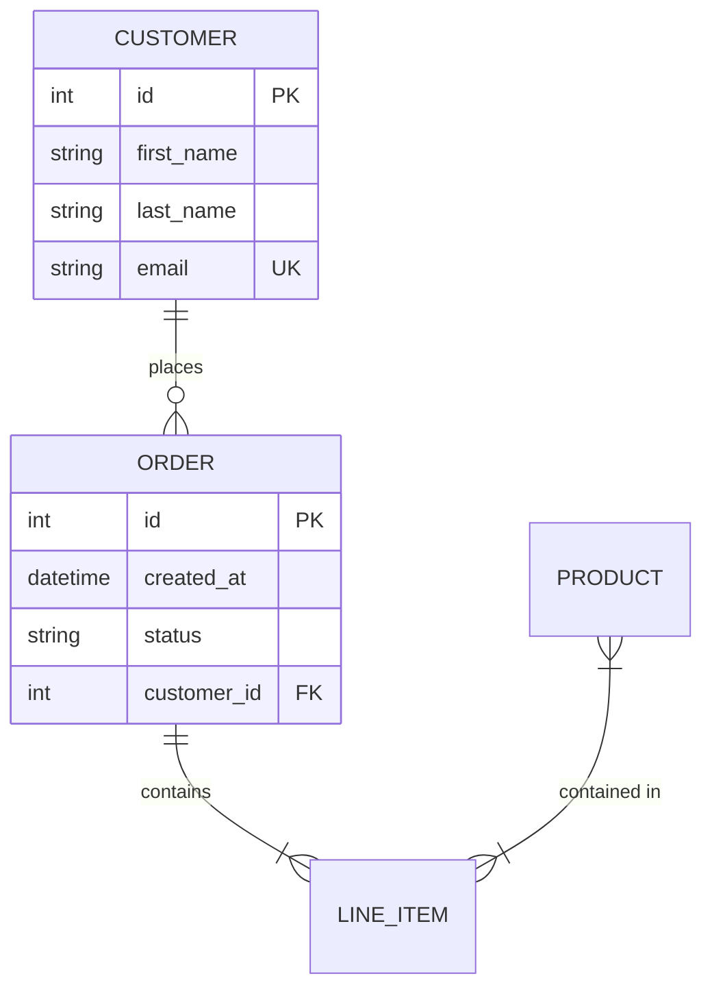

### Cardinalities
| Left | Right | Meaning |
|------|-------|---------|
| `\|o` | `o\|` | Zero or one |
| `\|\|` | `\|\|` | Exactly one |
| `}o` | `o{` | Zero or many |
| `}\|` | `\|{` | One or many |

Attribute types: `int` · `string` · `float` · `boolean` · `date` · `datetime`
Keys: `PK` · `FK` · `UK`

---

## State diagram (`stateDiagram-v2`)

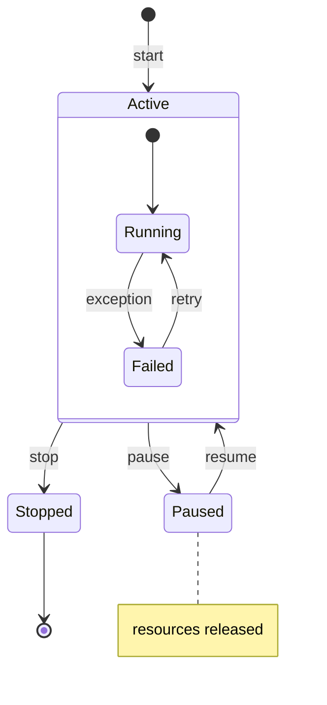

Parallel states:
```
state Parallel {
    [*] --> A
    --
    [*] --> B
}
```

Choice:
```
state Branch <<choice>>
state Join <<join>>
```

---

## Gantt chart (`gantt`)

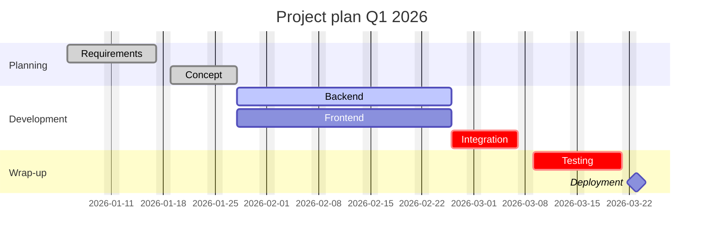

Status tags: `done` · `active` · `crit` · `milestone`
Date formats: `YYYY-MM-DD` · `DD/MM/YYYY` · `MM/DD/YYYY` · `YYYY/MM/DD`
Durations: `7d` · `2w` · `1m`

---

## Mindmap (`mindmap`)

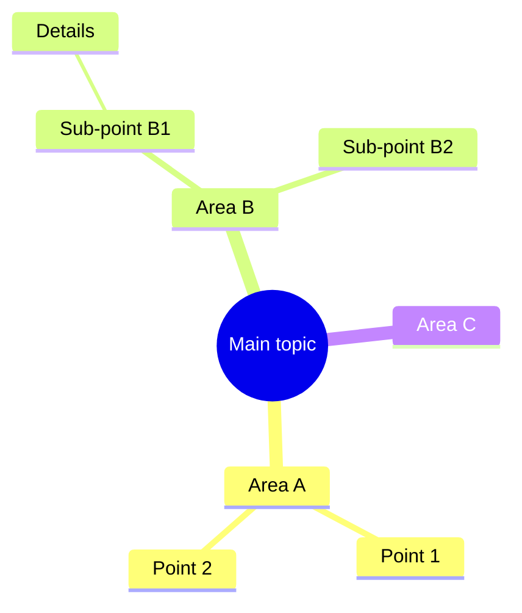

Shapes: `((round))` · `(rounded)` · `[square]` · `)cloud(` · `))bang((`
Icons: `::icon(fa fa-iconname)` (FontAwesome)

### ⚠ Mandatory rules for mindmaps

**1. ALWAYS quote free-text labels as `["..."]`.** Parentheses `( ) [ ] { }` in a plain label are parsed as shape syntax:

- `Failover (fallback)` → parses, but displays **only "fallback"** (the text before becomes the node ID)
- `Audio (.mp3, .wav) continued` → **parse error**, the entire diagram fails to render

Therefore: quote every label containing copied text (titles, sentences, file names) uniformly — do not decide case by case. Only self-chosen short branch names (1–3 words, no special characters) may stay plain.

**2. Group from ~8 entries.** The radial layouter collides with many flat sibling nodes — boxes overlap. Insert an intermediate level with 3–6 thematic branches:

```
mindmap
  root((Features))
    Provider & Infrastructure
      ["Provider failover on outage (fallback)"]
      ["Token price calculation"]
    Agents & Chains
      ["Agent builder"]
      ["Resolve A2A chain precedence"]
    UI & Usability
      ["Memory view as tree"]
      ["Pinning for chat history<br/>and projects"]
```

**3. Wrap labels longer than ~50 characters** with `<br/>` or shorten them.

**4. Optional** extra spacing: `%%{init: {"mindmap": {"padding": 16}}}%%` before `mindmap`.

---

## Pie chart (`pie`)

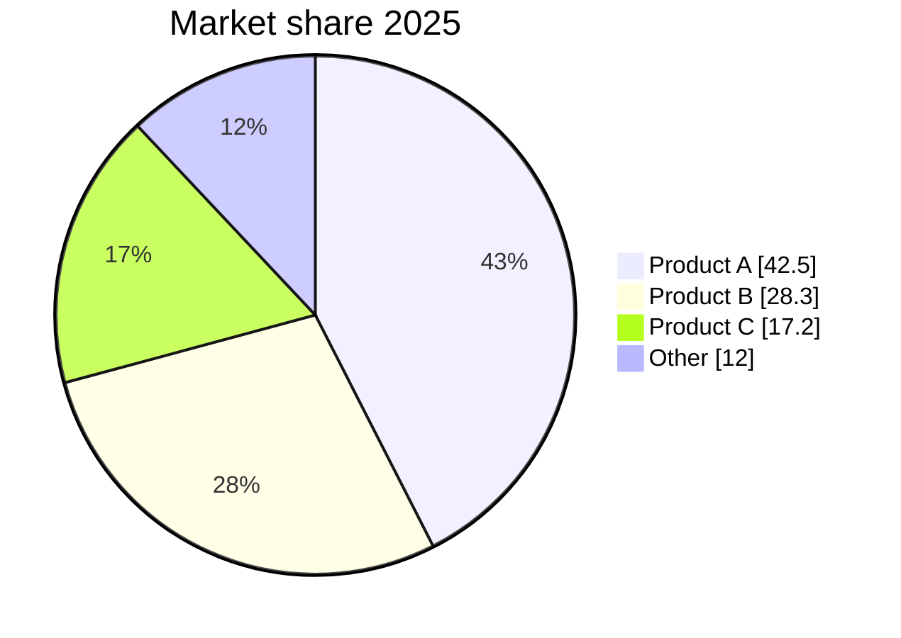

`showData` — display values in the chart (optional).

---

## Git graph (`gitGraph`)

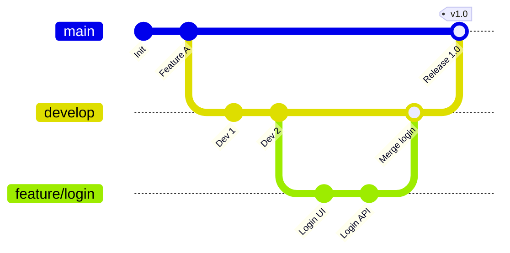

Types: `commit type: HIGHLIGHT` · `commit type: REVERSE` · `commit type: NORMAL`

---

## XY chart (`xychart-beta`)

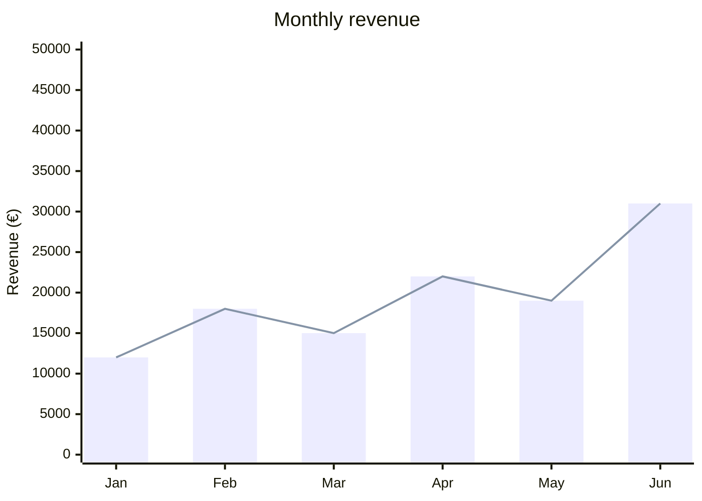

---

## Timeline (`timeline`)

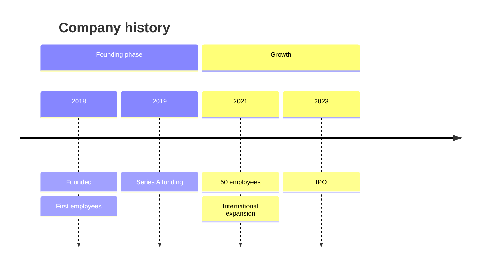

---

## Kanban (`kanban`)

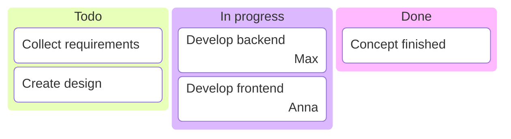

---

## Quadrant chart (`quadrantChart`)

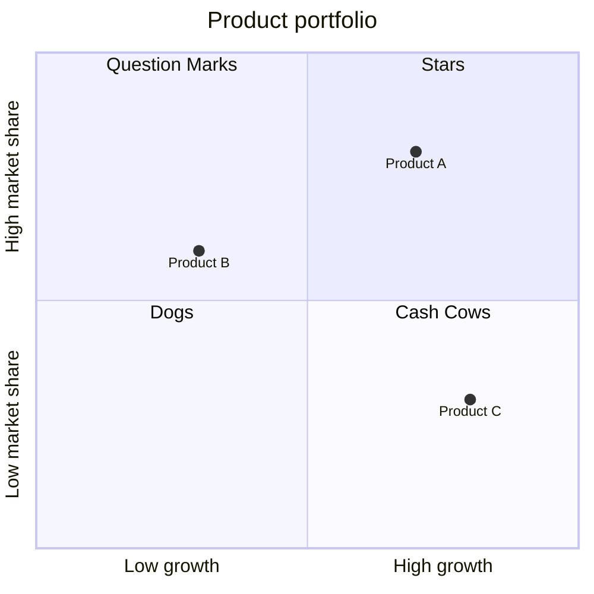

---

## Block diagram (`block-beta`)

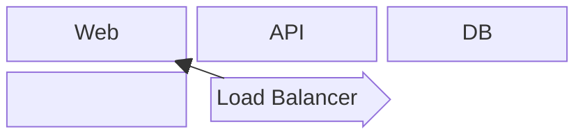

---

## Architecture (`architecture-beta`)

For cloud/service architectures with icons. A flowchart with subgraphs is
usually the more robust choice — use `architecture-beta` only when its icon
style is explicitly wanted.

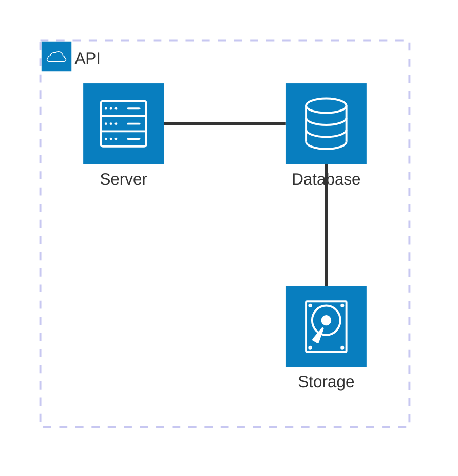

Icons: `cloud` · `database` · `disk` · `internet` · `server`
Edge ports: `L` / `R` / `T` / `B` (left/right/top/bottom).

---

## Theme configuration (all types)

```
%%{init: {"theme": "neutral"}}%%
```

Themes: `default` · `neutral` · `dark` · `forest` · `base`

Custom colors with the `base` theme:
```
%%{init: {"theme": "base", "themeVariables": {"primaryColor": "#ff9900", "primaryTextColor": "#fff"}}}%%
```
