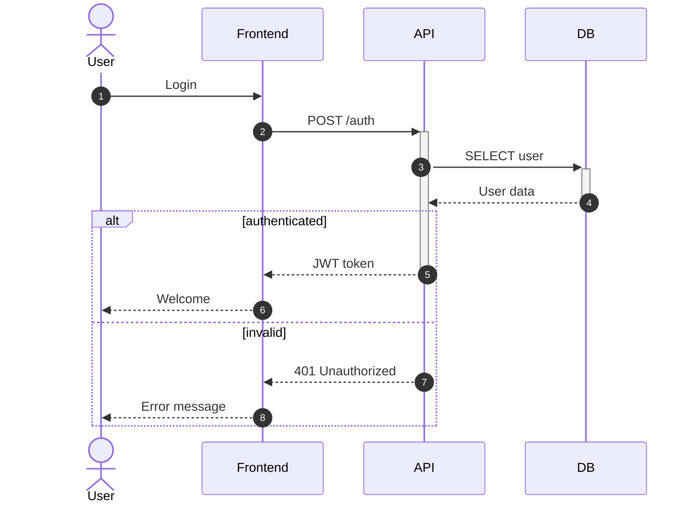

# Sequence diagram — complete syntax

## Basic structure

```
sequenceDiagram
    participant A
    participant B
    A->>B: Message
```

---

## Participants

```
participant ID as Display name
actor ID as Display name        %% stick figure
```

Order: matches declaration order.

Create/destroy participants:
```
create participant C
A->>C: Created
destroy C
C-->>A: Destroyed
```

---

## Arrow types

| Syntax | Rendering |
|--------|-----------|
| `A->B: text` | Solid line, no arrowhead |
| `A-->B: text` | Dashed line, no arrowhead |
| `A->>B: text` | Solid line, arrowhead |
| `A-->>B: text` | Dashed line, arrowhead |
| `A-)B: text` | Solid line, open arrowhead (async) |
| `--)` | Dashed line, open arrowhead (async) |
| `A-xB: text` | Solid line, cross |
| `A--xB: text` | Dashed line, cross |

---

## Activation boxes

```
A->>+B: Request      %% start activation
B-->>-A: Response    %% end activation
```

Or explicitly:
```
activate B
deactivate B
```

---

## Notes

```
Note right of A: text
Note left of B: text
Note over A,B: spans both
```

---

## Loops, alternatives, parallelism

```
loop condition
    A->>B: message
end

alt success
    A->>B: OK
else failure
    A->>B: error
end

opt optional block
    A->>B: only if needed
end

par parallel A
    A->>B: task 1
and parallel B
    A->>C: task 2
end

critical transaction scope
    A->>B: critical
option timeout
    A->>B: fallback
end

break abort condition
    A->>B: abort
end
```

---

## Backgrounds (highlight boxes)

```
rect rgb(0, 200, 100)
    A->>B: highlighted section
end
```

---

## Comments

```
%% This is a comment
```

---

## Auto-numbering

```
sequenceDiagram
    autonumber
    A->>B: first message
    B-->>A: response
```

---

## Complete example


